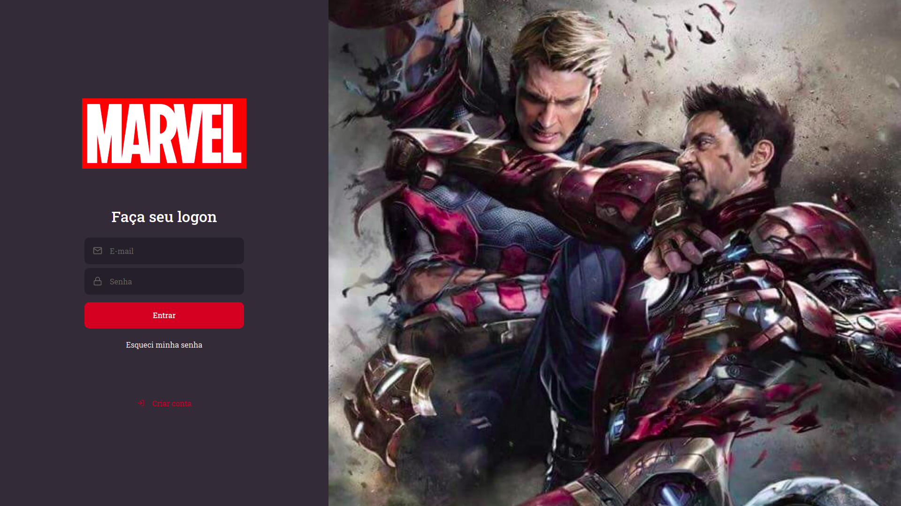
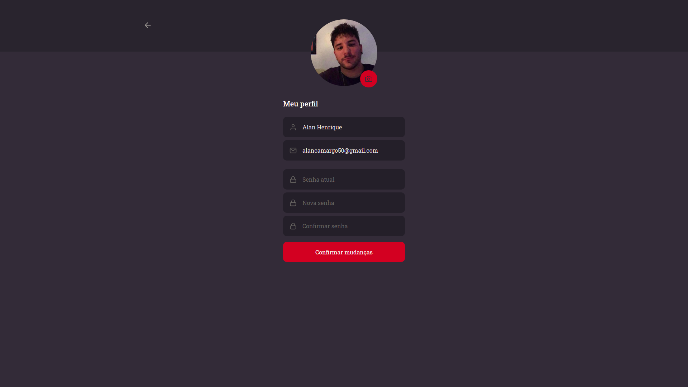
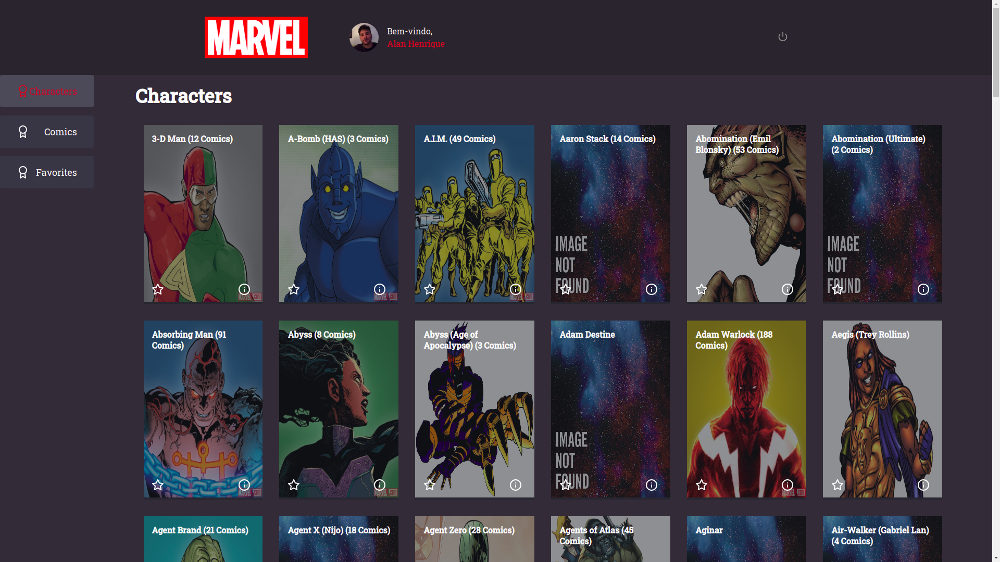
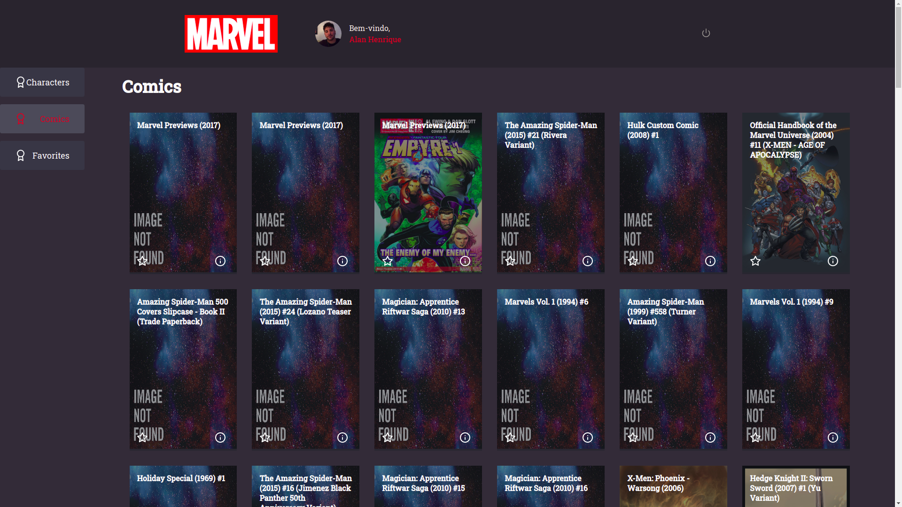

# Technologies Used

- Reactjs
- Hooks
- Axios
- Typescript
- MVC / DDD
- CI / CD
- Eslint

<br />

Link para site [Marvel Desafio](https://marvel.devideias.com).

Link para repositorio [Repositorio Backend](https://github.com/alanhrc/Marvel-Desafio-Stone-Api).

<br />

```json
  Open the project and whrite

  yarn

  Clone file .env.example to .env and fill it
```
<br />





